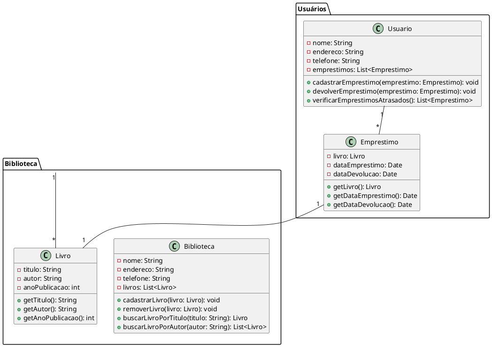

Claro! Aqui está um exemplo de um código complexo em UML, que representa um sistema de gerenciamento de biblioteca:

Neste código em UML, temos dois pacotes principais: "Biblioteca" e "Usuários". No pacote "Biblioteca", temos a classe "Biblioteca", que possui atributos como nome, endereço, telefone e uma lista de livros. Essa classe possui métodos para cadastrar, remover e buscar livros por título ou autor.

Também no pacote "Biblioteca", temos a classe "Livro", com atributos como título, autor e ano de publicação. Essa classe possui métodos para obter o título, autor e ano de publicação do livro.

No pacote "Usuários", temos a classe "Usuario", com atributos como nome, endereço, telefone e uma lista de empréstimos. Essa classe possui métodos para cadastrar empréstimos, devolver empréstimos e verificar empréstimos atrasados.

Além disso, no pacote "Usuários", temos a classe "Emprestimo", com atributos como livro, data de empréstimo e data de devolução. Essa classe possui métodos para obter o livro, a data de empréstimo e a data de devolução do empréstimo.

As associações entre as classes são representadas por setas, indicando a cardinalidade da relação. Por exemplo, uma biblioteca pode ter vários livros (1 -> *), um usuário pode ter vários empréstimos (1 -> *) e um empréstimo está associado a apenas um livro e um usuário (1 -> 1).

Espero que este exemplo atenda às suas expectativas de complexidade e diferenciação.