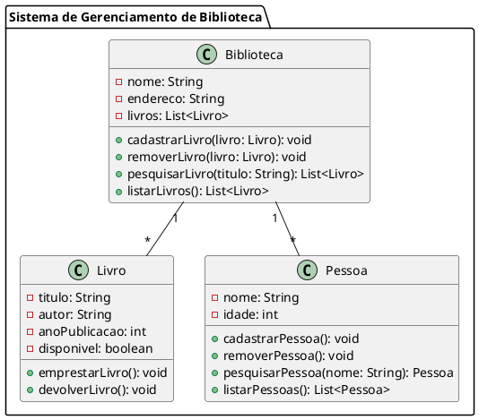

Claro! Aqui está um exemplo de um código complexo em UML que representa um sistema de gerenciamento de biblioteca:

Neste código, temos três classes principais: `Biblioteca`, `Livro` e `Pessoa`. A classe `Biblioteca` possui os atributos `nome`, `endereco` e `livros`, além dos métodos `cadastrarLivro`, `removerLivro`, `pesquisarLivro` e `listarLivros`. A classe `Livro` possui os atributos `titulo`, `autor`, `anoPublicacao` e `disponivel`, e os métodos `emprestarLivro` e `devolverLivro`. A classe `Pessoa` possui os atributos `nome` e `idade`, e os métodos `cadastrarPessoa`, `removerPessoa`, `pesquisarPessoa` e `listarPessoas`.

A relação entre as classes é representada pelos conectores. A classe `Biblioteca` possui uma associação de composição com a classe `Livro`, indicando que a biblioteca possui uma coleção de livros. Da mesma forma, a classe `Biblioteca` possui uma associação de composição com a classe `Pessoa`, indicando que a biblioteca possui uma coleção de pessoas.

Esse é apenas um exemplo de código complexo em UML, mas a UML possui diferentes diagramas e elementos que podem ser utilizados para modelar sistemas de diferentes complexidades.