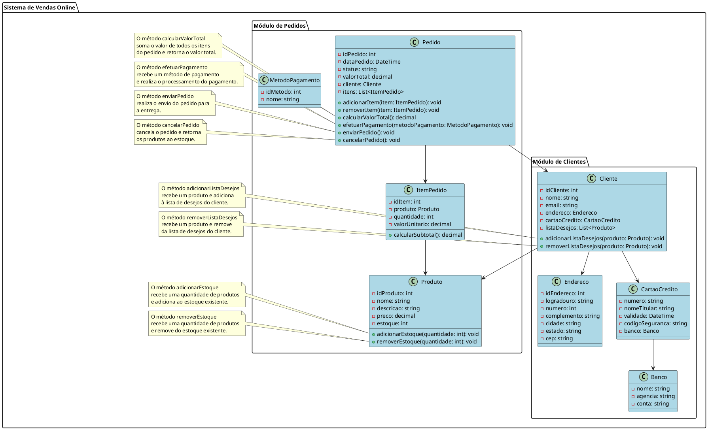

Claro! Aqui está um exemplo de um código complexo em UML que representa um sistema de vendas online:

Neste exemplo, o sistema de vendas online é representado por meio de classes como Pedido, ItemPedido, Produto, MétodoPagamento, Cliente, Endereco, CartaoCredito e Banco. Essas classes possuem atributos e métodos para realizar as operações relacionadas à compra, pagamento, entrega e gerenciamento de clientes.

As notas à esquerda e à direita fornecem informações adicionais sobre alguns métodos específicos de cada classe, como a função do método e o que ele retorna.

Espero que isso lhe dê uma visão geral de como seria um código complexo em UML para um sistema de vendas online. Este é apenas um exemplo, e um sistema real poderia ter mais classes e relacionamentos dependendo dos requisitos específicos.