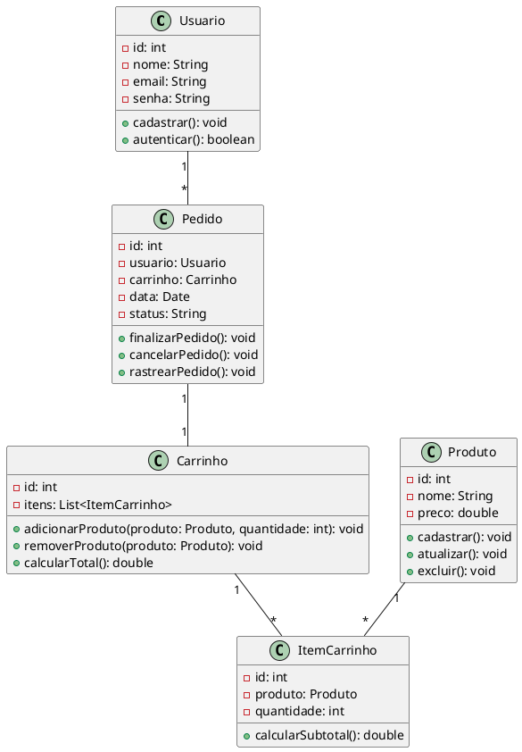

Claro! Aqui está um exemplo complexo de um diagrama de classe em UML, que representa um sistema de vendas online:

Neste exemplo, temos as classes `Usuario`, `Produto`, `Carrinho`, `ItemCarrinho` e `Pedido`. 

A classe `Usuario` representa um usuário que pode se cadastrar e autenticar no sistema de vendas online. Ela contém atributos como `id`, `nome`, `email` e `senha`.

A classe `Produto` representa um produto disponível para compra. Ela possui atributos como `id`, `nome` e `preco`, e métodos para cadastrar, atualizar e excluir o produto.

A classe `Carrinho` representa o carrinho de compras do usuário, onde são armazenados os itens selecionados para compra. Ela possui um atributo `itens`, que é uma lista de `ItemCarrinho`. A classe `Carrinho` possui métodos para adicionar e remover produtos do carrinho, além de calcular o total da compra.

A classe `ItemCarrinho` representa um item do carrinho de compras. Ela possui atributos como `id`, `produto` (referência a um produto) e `quantidade`. A classe `ItemCarrinho` possui um método para calcular o subtotal do item.

A classe `Pedido` representa um pedido de compra realizado pelo usuário. Ela possui atributos como `id`, `usuario` (referência ao usuário que realizou o pedido), `carrinho` (referência ao carrinho de compras do pedido), `data` e `status`. A classe `Pedido` possui métodos para finalizar, cancelar e rastrear o pedido.

As associações entre as classes são representadas pelas setas. Por exemplo, um `Usuario` pode ter vários `Pedido`, indicado pela associação "1" -- "*".

Espero que esse exemplo tenha sido útil para você! Se tiver mais alguma dúvida ou solicitação, estou à disposição.