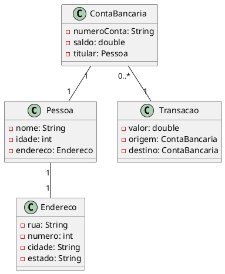

Claro! Aqui está um exemplo complexo de um diagrama de classe UML em português:

Neste exemplo, o diagrama de classe UML representa um sistema bancário simples. Ele possui três classes principais: `Pessoa`, `Endereco`, `ContaBancaria` e `Transacao`.

A classe `Pessoa` contém atributos como `nome`, `idade` e `endereco`. O atributo `endereco` é uma instância da classe `Endereco`, que possui atributos como `rua`, `numero`, `cidade` e `estado`.

A classe `ContaBancaria` representa uma conta bancária e possui atributos como `numeroConta`, `saldo` e `titular`, que é uma instância da classe `Pessoa`.

A classe `Transacao` representa uma transação financeira e possui atributos como `valor`, `origem` (uma instância da classe `ContaBancaria`) e `destino` (outra instância da classe `ContaBancaria`).

As associações entre as classes são representadas por linhas sólidas com multiplicidades indicadas. Por exemplo, a associação entre `Pessoa` e `Endereco` é uma relação 1-1, enquanto a associação entre `ContaBancaria` e `Transacao` é uma relação 0..*-1, indicando que uma conta bancária pode ter várias transações.

Esse é apenas um exemplo de diagrama de classe UML e sua complexidade pode variar dependendo dos requisitos e do contexto do sistema sendo modelado.