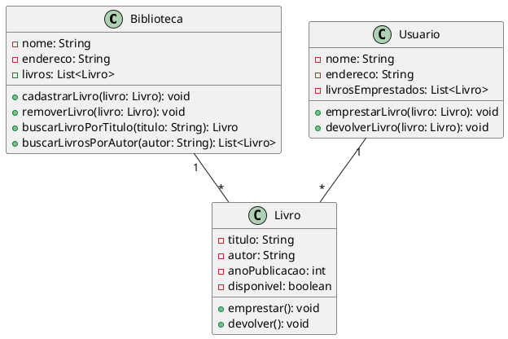

Claro! Aqui está um exemplo de um diagrama de classes em UML para um sistema de gerenciamento de biblioteca:

Neste exemplo, temos três classes principais: `Biblioteca`, `Livro` e `Usuario`. A classe `Biblioteca` representa uma biblioteca e possui atributos como `nome`, `endereco` e `livros` (que é uma lista de objetos da classe `Livro`). Além disso, possui métodos como `cadastrarLivro`, `removerLivro`, `buscarLivroPorTitulo` e `buscarLivrosPorAutor` para gerenciar os livros da biblioteca.

A classe `Livro` representa um livro e possui atributos como `titulo`, `autor`, `anoPublicacao` e `disponivel` (que indica se o livro está disponível para empréstimo ou não). Também possui métodos como `emprestar` e `devolver` para controlar o empréstimo e a devolução dos livros.

Por fim, a classe `Usuario` representa um usuário da biblioteca e possui atributos como `nome`, `endereco` e `livrosEmprestados` (que é uma lista de objetos da classe `Livro` que o usuário possui emprestado). Possui métodos como `emprestarLivro` e `devolverLivro` para permitir que o usuário faça o empréstimo e a devolução de livros.

Essas classes estão relacionadas entre si através de associações. A classe `Biblioteca` possui uma associação de um-para-muitos com a classe `Livro`, indicando que uma biblioteca pode ter vários livros. Da mesma forma, a classe `Usuario` também possui uma associação de um-para-muitos com a classe `Livro`, indicando que um usuário pode ter vários livros emprestados.

Espero que este exemplo tenha lhe ajudado!