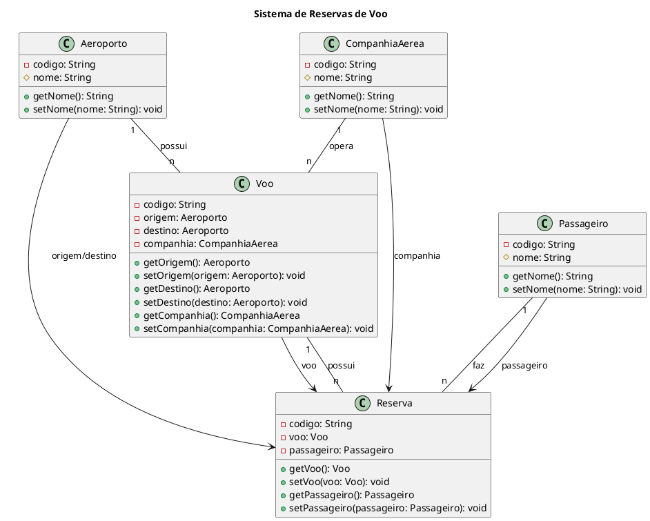

Claro! Aqui está um exemplo de código UML complexo em português:

Nesse exemplo, construí um diagrama de classes UML para um sistema de reservas de voos. O diagrama é composto por cinco classes principais: Aeroporto, CompanhiaAerea, Voo, Passageiro e Reserva.

A classe Aeroporto representa um aeroporto e possui um código e um nome. A classe CompanhiaAerea representa uma companhia aérea e também possui um código e um nome. A classe Voo representa um voo específico, com um código, uma origem (objeto Aeroporto), um destino (objeto Aeroporto) e uma companhia aérea (objeto CompanhiaAerea).

A classe Passageiro representa um passageiro e possui um código e um nome. Por fim, a classe Reserva representa uma reserva de voo feita por um Passageiro para um determinado Voo. A classe Reserva possui um código, um objeto Voo e um objeto Passageiro.

As relações entre as classes são representadas pelos conectores. A classe Aeroporto possui uma associação de "1 para muitos" com a classe Voo, indicando que um aeroporto pode ter vários voos. Da mesma forma, a classe CompanhiaAerea possui uma associação de "1 para muitos" com a classe Voo, indicando que uma companhia aérea pode operar vários voos.

A classe Voo possui uma associação de "1 para muitos" com a classe Reserva, indicando que um voo pode ter várias reservas. Da mesma forma, a classe Passageiro possui uma associação de "1 para muitos" com a classe Reserva, indicando que um passageiro pode fazer várias reservas.

Espero que isso ajude a entender o conceito de um código UML complexo em português!