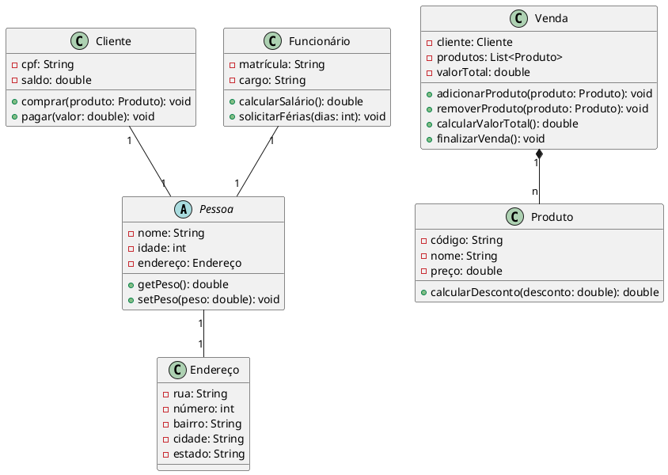

Claro! Aqui está um exemplo complexo de um diagrama de classes em UML:

Neste exemplo, temos um diagrama de classes que representa um sistema de vendas. 

A classe abstrata `Pessoa` representa uma pessoa genérica, com atributos como nome, idade e endereço. Ela possui métodos para obter e definir o peso. As classes `Cliente` e `Funcionário` são subclasses de `Pessoa`, representando respectivamente um cliente e um funcionário. O cliente possui atributos específicos como CPF e saldo, além de métodos para comprar produtos e pagar. O funcionário possui atributos como matrícula e cargo, além de métodos para calcular salário e solicitar férias.

A classe `Produto` representa um produto disponível para venda, com atributos como código, nome e preço. Ela possui um método para calcular o desconto em um determinado valor. A classe `Endereço` representa o endereço de uma pessoa, com atributos como rua, número, bairro, cidade e estado.

A classe `Venda` representa uma venda realizada, com atributos como cliente, lista de produtos e valor total. Ela possui métodos para adicionar e remover produtos, calcular o valor total da venda e finalizar a venda.

As relações entre as classes são representadas pelas setas e multiplicidades. Por exemplo, uma pessoa possui um endereço (relação 1 para 1), uma venda possui vários produtos (relação 1 para n), um cliente é uma pessoa (herança) e assim por diante.

Esse é apenas um exemplo para ilustrar a complexidade de um diagrama de classes em UML. É importante ressaltar que a UML possui outros diagramas, como diagrama de casos de uso, diagrama de sequência, diagrama de atividades, entre outros, que podem ser utilizados para representar diferentes aspectos de um sistema de software.