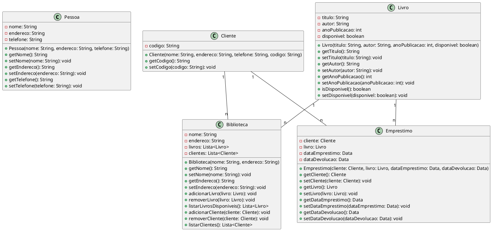

Claro! Aqui está um exemplo de um diagrama de classes em UML para um sistema de gerenciamento de biblioteca:

Neste código, estamos representando um sistema de gerenciamento de biblioteca utilizando classes em UML. Temos as classes `Pessoa`, `Cliente`, `Livro`, `Biblioteca` e `Emprestimo`. Cada classe possui atributos específicos e métodos para manipular esses atributos.

A classe `Pessoa` representa uma pessoa genérica com atributos como nome, endereço e telefone. A classe `Cliente` herda da classe `Pessoa` e possui um atributo adicional, o código do cliente.

A classe `Livro` representa um livro com atributos como título, autor, ano de publicação e disponibilidade. A classe `Biblioteca` representa uma biblioteca com atributos como nome, endereço e uma lista de livros e clientes. A classe `Emprestimo` representa um empréstimo de livro realizado por um cliente, contendo atributos como o cliente, o livro, a data de empréstimo e a data de devolução.

As classes estão relacionadas entre si por meio de associações. Por exemplo, a classe `Cliente` possui um relacionamento de associação com a classe `Emprestimo`, indicando que um cliente pode realizar vários empréstimos. Da mesma forma, a classe `Livro` possui um relacionamento de associação com a classe `Emprestimo`, indicando que um livro pode ser emprestado várias vezes. Além disso, a classe `Livro` possui um relacionamento de associação com a classe `Biblioteca`, indicando que um livro pertence a uma biblioteca. O mesmo ocorre com a classe `Cliente`.

Esse é um exemplo de diagrama de classes em UML para um sistema de gerenciamento de biblioteca, onde é possível visualizar as classes, seus atributos, métodos e relacionamentos.