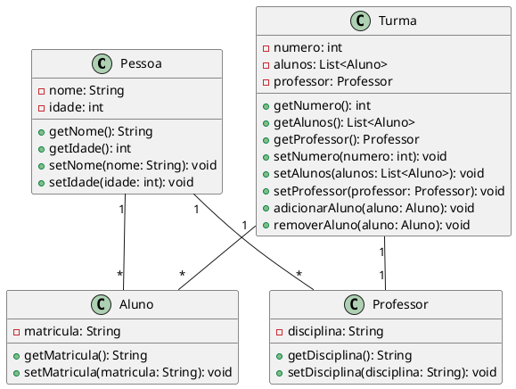

Claro! Aqui está um exemplo de um diagrama de classes em UML, que é uma representação visual de como as classes de um sistema se relacionam entre si.

Neste exemplo, temos quatro classes: Pessoa, Aluno, Professor e Turma. A classe Pessoa representa uma pessoa genérica, com os atributos nome e idade, e os métodos get e set correspondentes. A classe Aluno, por sua vez, é uma subclasse de Pessoa e possui um atributo adicional, matricula, além de herdar os métodos de Pessoa.

A classe Professor também é uma subclasse de Pessoa e possui um atributo adicional, disciplina. Novamente, ela herda os métodos de Pessoa. Por fim, a classe Turma representa uma turma de alunos, com um número identificador, uma lista de alunos e um professor. 

A relação "1" -- "*" entre Pessoa e Aluno significa que uma pessoa pode ter vários alunos associados a ela. Da mesma forma, a relação "1" -- "*" entre Pessoa e Professor indica que uma pessoa pode ser professora de vários professores. 

A relação "1" -- "*" entre Turma e Aluno significa que uma turma pode ter vários alunos associados a ela. E a relação "1" -- "1" entre Turma e Professor indica que uma turma possui um único professor associado a ela.

Este é apenas um exemplo básico de um diagrama de classes em UML. É importante ressaltar que existem muitas outras notações e elementos que podem ser adicionados para tornar o diagrama mais completo e detalhado, dependendo das necessidades do sistema em questão.