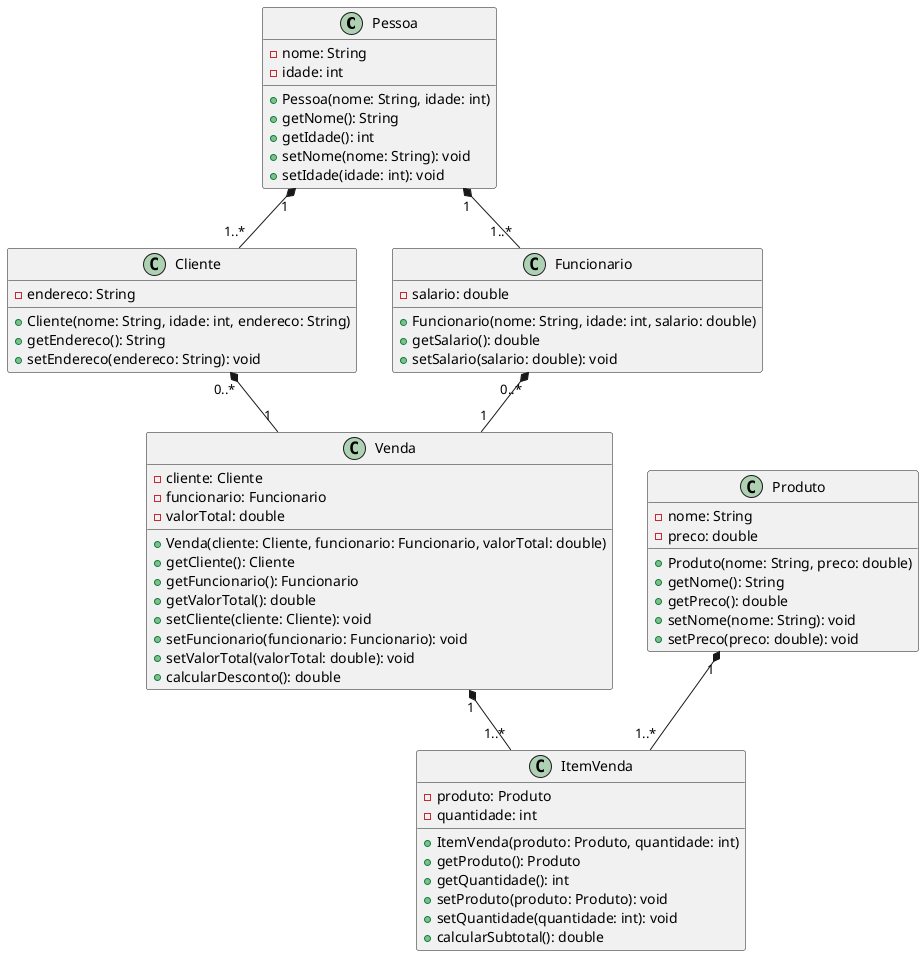

Claro! Aqui está um exemplo complexo de um diagrama de classes em UML:

Neste diagrama, temos as classes `Pessoa`, `Cliente`, `Funcionario`, `Venda`, `Produto` e `ItemVenda`, que representam entidades de um sistema de vendas. 

- A classe `Pessoa` possui atributos como `nome` e `idade`, e métodos para obter e definir esses atributos.
- A classe `Cliente` é uma subclasse de `Pessoa`, adicionando o atributo `endereco`, bem como métodos para obter e definir esse atributo.
- A classe `Funcionario` também é uma subclasse de `Pessoa`, adicionando o atributo `salario`, juntamente com os métodos correspondentes.
- A classe `Venda` possui atributos como `cliente`, `funcionario` e `valorTotal`, bem como métodos para obter e definir esses atributos, além de um método `calcularDesconto()` para calcular o desconto da venda.
- A classe `Produto` possui atributos como `nome` e `preco`, bem como métodos para obter e definir esses atributos.
- A classe `ItemVenda` possui atributos como `produto` e `quantidade`, bem como métodos para obter e definir esses atributos, além de um método `calcularSubtotal()` para calcular o subtotal do item de venda.

As classes são conectadas por associações, indicando a relação entre elas. Por exemplo, `Pessoa` tem uma associação com `Cliente` e `Funcionario`, indicando que um objeto `Pessoa` pode se tornar um `Cliente` ou um `Funcionario`. Além disso, `Cliente`, `Funcionario` e `Produto` têm associações com `ItemVenda`, indicando que eles podem ser vendidos em uma `Venda`.

Espero que esse exemplo atenda às suas expectativas!