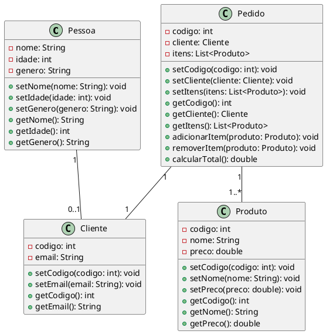

Claro! Aqui está um exemplo complexo de um diagrama de classes em UML:

Neste exemplo, temos as classes `Pessoa`, `Cliente`, `Produto` e `Pedido` representando entidades de um sistema de vendas. A classe `Pessoa` possui atributos como `nome`, `idade` e `genero`, além de métodos para acessar e modificar esses atributos. A classe `Cliente` é uma subclasse de `Pessoa` e possui atributos adicionais como `codigo` e `email`, também com métodos de acesso e modificação.

A classe `Produto` representa um item disponível para compra, com atributos como `codigo`, `nome` e `preco`. A classe `Pedido` representa um pedido feito por um cliente, com atributos como `codigo`, `cliente` (do tipo `Cliente`) e `itens` (uma lista de `Produto`). Além dos métodos para acessar e modificar esses atributos, a classe `Pedido` também possui métodos para adicionar e remover itens do pedido, e calcular o total do pedido com base nos preços dos produtos.

O diagrama de classes mostra também as associações entre as classes. Por exemplo, um `Pedido` está associado a um único `Cliente`, e um `Pedido` está associado a vários `Produtos`.