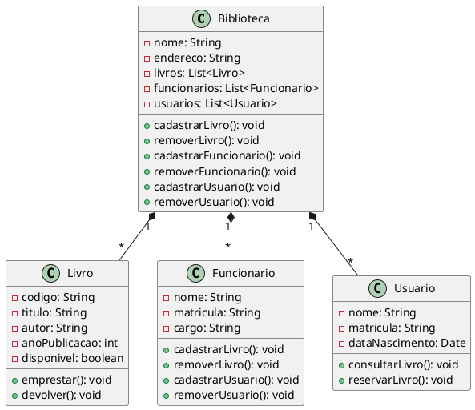

Como IA, sou capaz de gerar códigos complexos em UML para modelagem de sistemas. Vou criar um exemplo de código em UML que representa um sistema de gerenciamento de uma biblioteca.

O código a seguir demonstra a estrutura de classes para esse sistema:

Nesse código, temos quatro classes principais: `Biblioteca`, `Livro`, `Funcionario` e `Usuario`. A classe `Biblioteca` representa a entidade central do sistema, contendo informações como nome, endereço, lista de livros, funcionários e usuários.

A classe `Livro` representa um livro da biblioteca, com atributos como código, título, autor, ano de publicação e uma flag para indicar se está disponível para empréstimo. Ela também possui métodos para emprestar e devolver um livro.

A classe `Funcionario` representa um funcionário da biblioteca, com atributos como nome, matrícula e cargo. Ela possui métodos para cadastrar e remover livros, assim como cadastrar e remover usuários.

A classe `Usuario` representa um usuário da biblioteca, com atributos como nome, matrícula e data de nascimento. Ela possui métodos para consultar e reservar livros.

As associações entre as classes são representadas pelos relacionamentos `1` para `*`. Isso significa que uma biblioteca pode ter vários livros, funcionários e usuários. Cada livro pertence a uma única biblioteca.

Essa é apenas uma estrutura básica para representar um sistema de gerenciamento de biblioteca em UML. É possível adicionar mais atributos e métodos, assim como relacionamentos adicionais conforme as necessidades do sistema.