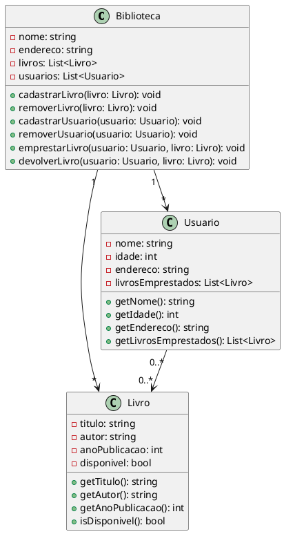

Claro! Abaixo você encontrará um exemplo de código em UML que representa um sistema de biblioteca:

Nesse exemplo, temos três classes principais: Biblioteca, Livro e Usuário. A classe Biblioteca representa a entidade da biblioteca, com atributos como nome, endereço, uma lista de livros cadastrados e uma lista de usuários cadastrados. Além disso, possui métodos para realizar operações como cadastrar e remover livros e usuários, emprestar e devolver livros.

A classe Livro representa um livro em si, com atributos como título, autor, ano de publicação e um indicador de disponibilidade. Possui métodos para acessar esses atributos.

A classe Usuário representa um usuário da biblioteca, com atributos como nome, idade, endereço e uma lista de livros emprestados. Também possui métodos para acessar esses atributos.

Os relacionamentos entre as classes são definidos através das setas. A biblioteca possui vários livros e vários usuários, enquanto um livro pode pertencer a apenas uma biblioteca e um usuário pode ter vários livros emprestados.

Essa é apenas uma estrutura básica em UML de um sistema de biblioteca. É possível adicionar mais atributos e métodos de acordo com as necessidades do sistema.