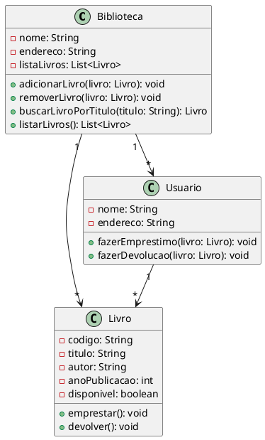

Claro! Vou criar um exemplo de código UML complexo em português, para ilustrar a modelagem de um sistema de gerenciamento de biblioteca. O código abaixo representa as classes e seus relacionamentos:

Nesse exemplo, temos três classes principais: `Biblioteca`, `Livro` e `Usuario`. A classe `Biblioteca` possui atributos como `nome`, `endereco` e `listaLivros`, além de métodos para adicionar, remover, buscar e listar livros. A classe `Livro` possui atributos como `codigo`, `titulo`, `autor`, `anoPublicacao` e `disponivel`, além de métodos para emprestar e devolver o livro. A classe `Usuario` possui atributos como `nome` e `endereco`, e métodos para fazer empréstimo e devolução de livros.

Os relacionamentos entre as classes são definidos com as setas. A biblioteca possui uma lista de livros (`Biblioteca "1" --> "*" Livro`), uma lista de usuários (`Biblioteca "1" --> "*" Usuario`) e cada usuário pode ter empréstimos de vários livros (`Usuario "1" --> "*" Livro`).

Esse é apenas um exemplo básico de modelagem em UML para um sistema de gerenciamento de biblioteca. A UML é uma linguagem visual poderosa para representar a estrutura e os relacionamentos de um sistema. É utilizada para auxiliar na comunicação e no entendimento do sistema entre desenvolvedores, analistas e stakeholders.