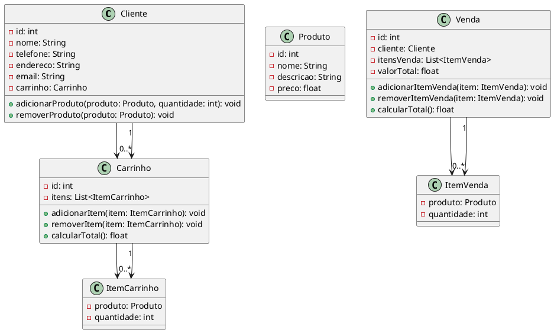

Claro, vou gerar um código complexo em UML para você. O exemplo abaixo é um modelo de um sistema de gerenciamento de vendas em uma loja de roupas. 

Neste exemplo de UML, temos as classes Cliente, Produto, Carrinho, ItemCarrinho, Venda e ItemVenda. 

A classe Cliente representa os clientes da loja, que possuem informações como id, nome, telefone, endereço e email. Além disso, cada cliente possui um carrinho de compras (representado pela classe Carrinho), onde ele pode adicionar ou remover produtos.

A classe Produto representa os produtos disponíveis na loja, com informações como id, nome, descrição e preço.

A classe Carrinho representa o carrinho de compras de um cliente, contendo um id e uma lista de itens (representados pela classe ItemCarrinho). O carrinho possui métodos para adicionar ou remover itens, bem como um método para calcular o total da compra.

A classe ItemCarrinho representa um item no carrinho de compras, com informações sobre o produto e a quantidade desse produto no carrinho.

A classe Venda representa uma venda realizada na loja, com informações como id, cliente, uma lista de itens vendidos (representados pela classe ItemVenda) e o valor total da venda. A classe Venda possui métodos para adicionar ou remover itens vendidos, além de um método para calcular o total da venda.

A classe ItemVenda representa um item vendido, com informações sobre o produto e a quantidade vendida.

Essas classes e suas relações definem a estrutura básica de um sistema de gerenciamento de vendas em uma loja de roupas. É importante ressaltar que esse é apenas um exemplo e o código pode ser adaptado e modificado de acordo com as necessidades específicas do projeto.