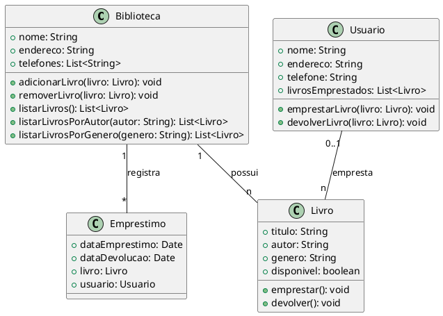

Claro! Aqui está um exemplo de um código complexo em UML que descreve um sistema de gerenciamento de biblioteca:

Nesse código em UML, temos a definição de três classes principais: Biblioteca, Livro e Usuario. A classe Biblioteca possui os atributos nome, endereco e telefones, além dos métodos adicionarLivro, removerLivro, listarLivros, listarLivrosPorAutor e listarLivrosPorGenero. A classe Livro possui os atributos titulo, autor, genero e disponivel, juntamente com os métodos emprestar e devolver. A classe Usuario possui os atributos nome, endereco, telefone e livrosEmprestados, além dos métodos emprestarLivro e devolverLivro.

Existem duas associações representadas no código. A primeira é a associação "possui", onde uma Biblioteca pode possuir vários Livros (relação 1 para muitos). A segunda é a associação "empresta", onde um Usuario pode emprestar vários Livros (relação 0 a muitos).

Além das associações, há também a classe Emprestimo, que representa o relacionamento entre Biblioteca e Livro. Essa classe possui os atributos dataEmprestimo, dataDevolucao, livro e usuario.

Essa é apenas uma representação em UML de um sistema de gerenciamento de biblioteca, mas a implementação do código em si não está inclusa neste exemplo.