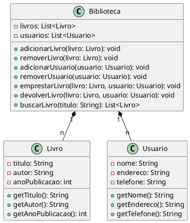

Claro! Aqui está um exemplo de um código em UML que representa um sistema de gerenciamento de biblioteca:

Neste código, temos três classes principais: `Biblioteca`, `Livro` e `Usuario`. A classe `Biblioteca` possui uma lista de `Livros` e uma lista de `Usuarios`. 

A classe `Biblioteca` contém métodos para adicionar e remover livros e usuários, emprestar e devolver livros, e buscar livros por título. 

A classe `Livro` possui atributos como título, autor e ano de publicação, juntamente com métodos para acessar esses atributos.

A classe `Usuario` possui atributos como nome, endereço e telefone, juntamente com métodos para acessar esses atributos.

As relações entre as classes são representadas pelos conectores `*--` e `1`, indicando que a `Biblioteca` possui uma associação de muitos para muitos com `Livro` e `Usuario`.

Este é apenas um exemplo de um sistema de gerenciamento de biblioteca em UML. É importante ressaltar que a complexidade e o tamanho do código podem variar dependendo dos requisitos e da funcionalidade desejada para o sistema.