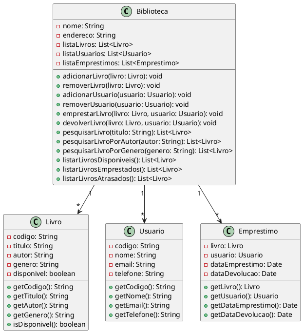

Certamente! Aqui está um código complexo em UML que representa um sistema de gerenciamento de biblioteca:

Neste código, temos as classes `Biblioteca`, `Livro`, `Usuario` e `Emprestimo`. A classe `Biblioteca` representa uma biblioteca real e possui atributos como `nome`, `endereco` e listas de `livros`, `usuarios` e `emprestimos`.

A classe `Livro` representa um livro presente na biblioteca, com atributos como `codigo`, `titulo`, `autor`, `genero` e um indicador de disponibilidade.

A classe `Usuario` representa um usuário que pode fazer empréstimo de livros da biblioteca, com atributos como `codigo`, `nome`, `email` e `telefone`.

A classe `Emprestimo` representa um empréstimo realizado por um usuário, relacionando um `livro` e um `usuario`, além de armazenar as datas de empréstimo e devolução.

A biblioteca possui métodos para adicionar e remover livros e usuários, emprestar e devolver livros, pesquisar livros por título, autor e gênero, e listar livros disponíveis, emprestados e atrasados.

Essa é uma representação básica de um sistema de gerenciamento de biblioteca em UML, com suas classes, atributos e relacionamentos.