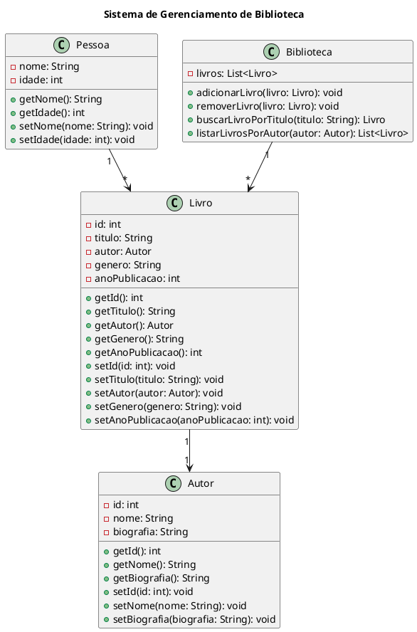

Claro! Aqui está um exemplo de um código complexo em UML:

Neste código em UML, temos um exemplo de um sistema de gerenciamento de biblioteca. 

A classe `Pessoa` representa uma pessoa genérica que pode ter vários livros. Ela possui os atributos `nome` e `idade`, e métodos para acessar e modificar esses atributos.

A classe `Autor` representa um autor de livros. Ela possui os atributos `id`, `nome` e `biografia`, e métodos para acessar e modificar esses atributos.

A classe `Livro` representa um livro. Ela possui os atributos `id`, `titulo`, `autor`, `genero` e `anoPublicacao`, e métodos para acessar e modificar esses atributos.

A classe `Biblioteca` representa a biblioteca em si. Ela possui uma lista de livros e métodos para adicionar, remover, buscar por título e listar livros por autor.

As relações entre as classes são representadas pelos conectores. A multiplicidade indica a cardinalidade da relação. Por exemplo, uma pessoa pode ter vários livros (`1` -> `*`), um livro tem apenas um autor (`1` -> `1`), e a biblioteca possui vários livros (`1` -> `*`).

Esse é apenas um exemplo de código complexo em UML, mas o UML é uma linguagem muito rica e flexível para modelagem de sistemas. Você pode criar diagramas UML para diferentes finalidades, como diagramas de classe, diagramas de sequência, diagramas de atividade, entre outros.