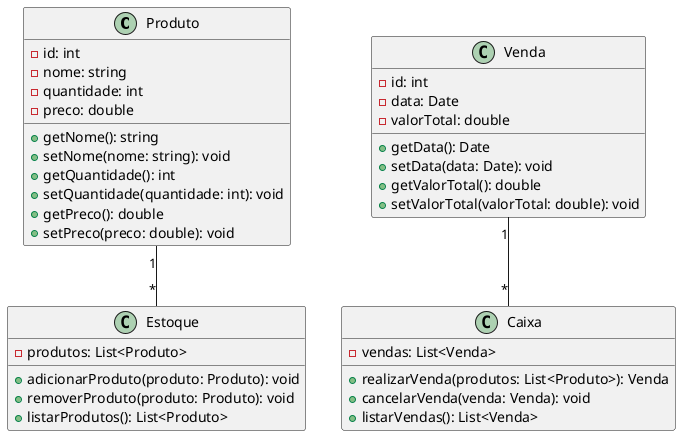

Claro! Aqui está um exemplo de um código complexo em UML que representa um sistema de gerenciamento de estoque:

Nesse código, temos três principais classes: `Produto`, `Estoque` e `Venda`. A classe `Produto` representa um item do estoque e possui atributos como `id`, `nome`, `quantidade` e `preco`, além de métodos para acessar e modificar esses atributos.

A classe `Estoque` é responsável pelo gerenciamento dos produtos e possui uma lista de produtos. Ela possui métodos para adicionar e remover produtos do estoque, bem como listar todos os produtos disponíveis.

A classe `Venda` representa uma venda de produtos e possui atributos como `id`, `data` e `valorTotal`. Essa classe também possui métodos para acessar e modificar esses atributos.

Por fim, temos a classe `Caixa`, que é responsável por realizar as vendas. Ela possui uma lista de vendas e métodos para realizar uma venda, cancelar uma venda e listar todas as vendas realizadas.

Essas classes estão relacionadas entre si através das associações indicadas pelo diagrama. Por exemplo, um `Estoque` possui vários `Produtos`, enquanto um `Caixa` possui várias `Vendas`.

Esse é apenas um exemplo de código complexo em UML, e é importante ressaltar que a UML é uma linguagem de modelagem visual que permite representar sistemas de forma abstrata, facilitando a compreensão e a comunicação entre os membros da equipe de desenvolvimento.