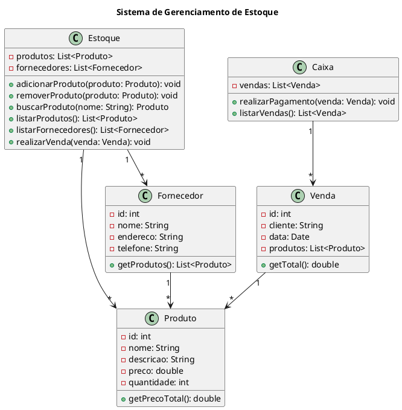

Claro! Abaixo você encontrará um exemplo de um código complexo em UML. Este código é uma representação de um sistema de gerenciamento de estoque para uma loja de varejo.

Neste exemplo, temos quatro classes principais: Produto, Fornecedor, Venda, Estoque e uma classe auxiliar Caixa para o gerenciamento das vendas. 

A classe Produto representa os dados de um produto, como seu ID, nome, descrição, preço e quantidade. A classe Fornecedor representa os dados de um fornecedor, como seu ID, nome, endereço e telefone. A classe Venda representa uma venda realizada, com ID, cliente, data e uma lista de produtos vendidos. A classe Estoque é responsável por gerenciar os produtos em estoque, com métodos para adicionar, remover, buscar e listar produtos, além de armazenar informações sobre os fornecedores.

A classe Caixa é responsável pelo gerenciamento das vendas e pagamentos. Ela possui um método para realizar o pagamento de uma venda e outro para listar as vendas realizadas.

As associações entre as classes são representadas por linhas, indicando a relação entre elas. Por exemplo, a classe Fornecedor possui uma associação de um para muitos com a classe Produto, indicando que um fornecedor pode fornecer vários produtos.

Espero que este exemplo atenda às suas expectativas!