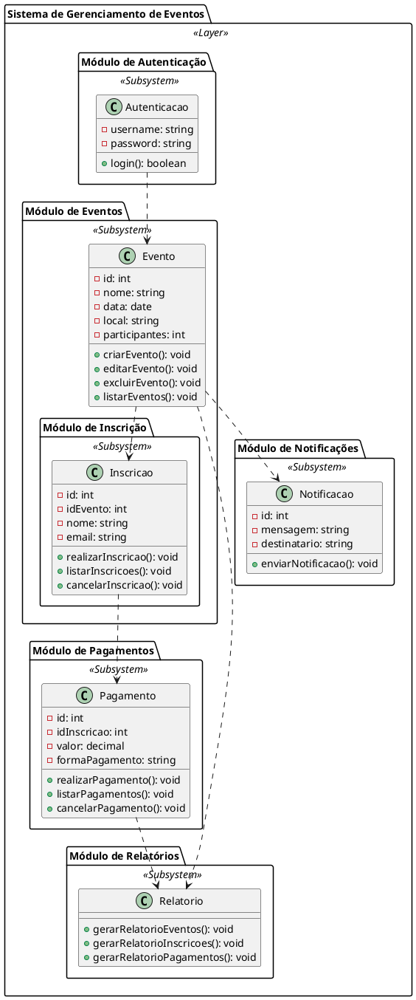

Claro! Segue abaixo um exemplo de um código complexo em UML:

Neste exemplo, temos um sistema de gerenciamento de eventos composto por diferentes módulos, representados como subsistemas. O módulo de autenticação é responsável pela autenticação dos usuários, enquanto o módulo de eventos cuida da criação, edição, exclusão e listagem de eventos. O módulo de inscrição permite realizar inscrições nos eventos, listar inscrições e cancelar inscrições. O módulo de pagamentos lida com o processamento de pagamentos, listagem de pagamentos e cancelamento de pagamentos.

O módulo de relatórios gera relatórios relacionados aos eventos, inscrições e pagamentos, enquanto o módulo de notificações envia notificações para os usuários, informando sobre eventos e outras informações relevantes.

Esses módulos estão interligados através de associações, que representam a dependência entre eles. Por exemplo, a classe Autenticacao está associada à classe Evento, indicando que o módulo de autenticação depende do módulo de eventos.

Esse código em UML é uma representação visual do sistema de gerenciamento de eventos, mostrando suas diferentes partes e como elas se relacionam entre si.