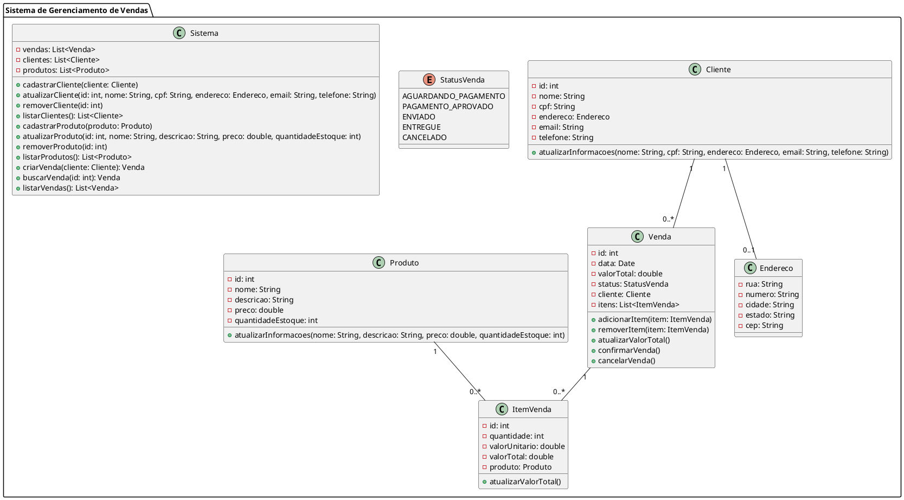

Claro! Aqui está um exemplo de um código UML complexo em português:

Neste exemplo, temos um Sistema de Gerenciamento de Vendas contendo as classes principais: Venda, ItemVenda, Cliente, Produto, Endereco e o enum StatusVenda. 

A classe Venda representa uma venda realizada pelo sistema, contendo informações como ID, data, valor total, status, cliente e itens da venda. Possui métodos para adicionar e remover itens, atualizar o valor total, confirmar a venda e cancelar a venda.

A classe ItemVenda representa um item presente em uma venda, contendo informações como ID, quantidade, valor unitário, valor total e o produto relacionado. Possui um método para atualizar o valor total do item.

A classe Cliente representa um cliente do sistema, contendo informações como ID, nome, CPF, endereço, e-mail e telefone. Possui um método para atualizar todas as informações do cliente.

A classe Produto representa um produto no sistema, contendo informações como ID, nome, descrição, preço e quantidade em estoque. Possui um método para atualizar todas as informações do produto.

A classe Endereco representa o endereço de um cliente, contendo informações como rua, número, cidade, estado e CEP.

O enum StatusVenda representa os diferentes status que uma venda pode ter: Aguardando Pagamento, Pagamento Aprovado, Enviado, Entregue e Cancelado.

Por fim, a classe Sistema representa o sistema de gerenciamento de vendas em si, contendo listas de vendas, clientes e produtos. Possui métodos para cadastrar, atualizar e remover clientes e produtos, listar todos os clientes e produtos, criar uma nova venda, buscar uma venda pelo ID e listar todas as vendas.

Essa é apenas uma representação ilustrativa de um código UML complexo, com classes, atributos, métodos, associações e enumerações. O UML é uma linguagem visual para modelagem de sistemas e pode ser usada para representar uma variedade de elementos e relacionamentos em um sistema de software.