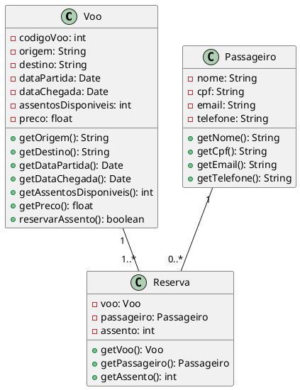

Claro! Vou gerar um exemplo de código em UML que representa um sistema de reservas de vôos.

Nesse código em UML, temos três classes principais: Voo, Passageiro e Reserva. 

A classe Voo representa um voo específico, com atributos como códigoVoo, origem, destino, dataPartida, dataChegada, assentosDisponiveis e preco. Além disso, possui métodos para obter informações sobre o voo e reservar assentos.

A classe Passageiro representa um passageiro do sistema, com atributos como nome, cpf, email e telefone. Também possui métodos para obter informações sobre o passageiro.

A classe Reserva representa uma reserva específica, relacionando um voo, um passageiro e um assento. Possui métodos para obter informações sobre a reserva.

A relação entre as classes é definida através das associações. Um voo pode ter várias reservas (1..*), enquanto um passageiro pode ter nenhuma ou várias reservas (0..*). Essas associações são representadas através dos relacionamentos entre as classes.