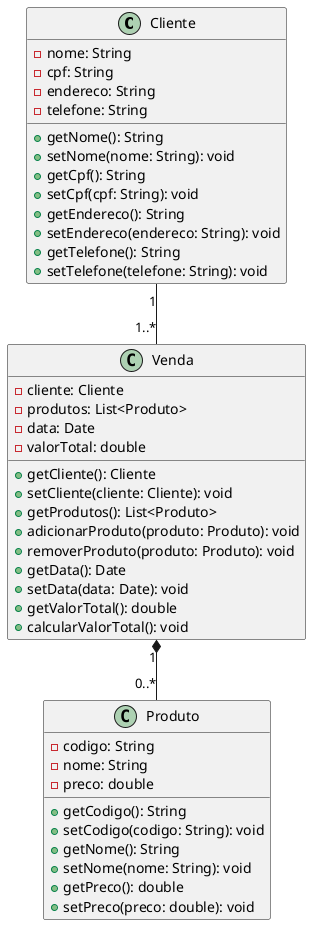

Claro! Aqui está um exemplo de código em UML representando um sistema de vendas de uma loja:

Nesse código em UML, temos três classes principais: `Cliente`, `Produto` e `Venda`. A classe `Cliente` representa um cliente da loja, com atributos como nome, CPF, endereço e telefone. A classe `Produto` representa um produto disponível para venda, com atributos como código, nome e preço. A classe `Venda` representa uma venda realizada na loja, com atributos como o cliente associado, a lista de produtos vendidos, a data da venda e o valor total.

Na representação visual do código, podemos observar as associações entre as classes. Um cliente pode realizar várias vendas, portanto há uma associação de 1 para muitos entre `Cliente` e `Venda`. Uma venda pode conter vários produtos e um produto pode estar presente em várias vendas, assim temos uma associação muitos para muitos entre `Venda` e `Produto`.

Esse código em UML é uma representação estrutural do sistema de vendas de uma loja, permitindo visualizar as classes envolvidas e as associações entre elas. É uma forma de modelar e comunicar a estrutura do sistema antes de implementá-lo em uma linguagem de programação específica.